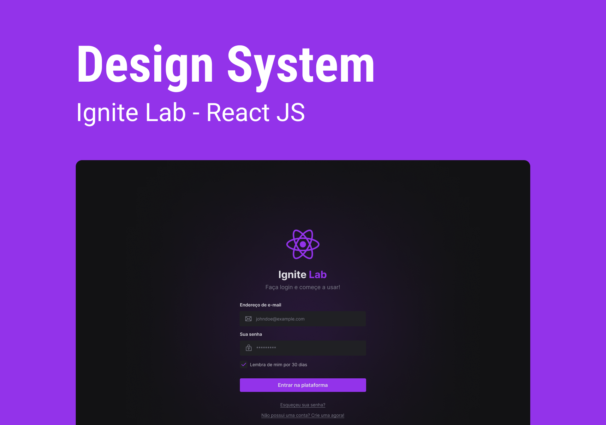

<p align="center">
  
</p>

<h4 align="center"><a href="https://lab-design-system-sampaiocode.vercel.app">Clique para visitar o projeto</a></h4>

---

## 💻 Sobre o projeto

Este projeto foi construído durante o **Ignite Lab 03 - React JS**, que tem como obejtivo desenvolver um Design System, do Figma ao React e utilizar tecnologias como, o Storybook para documentação dos componentes.

## 🛠️ Tecnologias

Este projeto foi desenvolvido utilizando as seguintes tecnologias:

- [ReactJS](https://reactjs.org/)
- [Tailwind CSS](https://tailwindcss.com/)
- [TypeScript](https://www.typescriptlang.org/)
- [Phosphor Icons](https://phosphoricons.com/)
- [Storybook](https://storybook.js.org/)
- [Radix UI](https://www.radix-ui.com/)
- [MSW](https://mswjs.io/)

## 🚀 Instalação

**Clone o projeto**

```bash
git clone https://github.com/sampaiocode/lab-design-system.git
```

**Siga os passos abaixo**

```bash
# Acesse a pasta
$ cd lab-design-system

# Instale as dependências
$ yarn

# Inicie a aplicação
$ yarn dev
```

## 📝 Licença

Esse projeto está sob licença. Veja o arquivo [LICENÇA](LICENSE) para mais detalhes.

---

Desenvolvido com 💙 por [Deivit Eduardo](https://github.com/sampaiocode)
